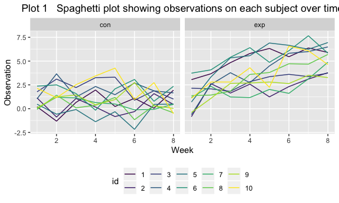
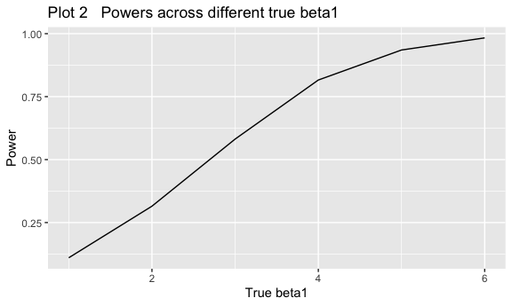
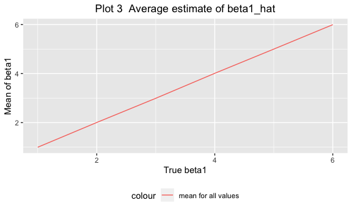
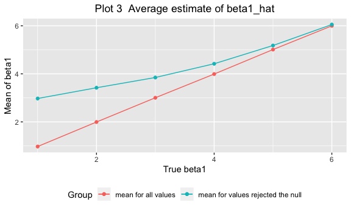

p8105\_hw5\_rq2166
================
Ruoyuan Qian
11/10/2019

# Problem 1

``` r
set.seed(10)
iris_with_missing = iris %>%
  map_df(~replace(.x, sample(1:150, 20), NA)) %>%
  mutate(Species = as.character(Species))
```

``` r

fill_na = function(x) {
  
  if (is.numeric(x)) {
    replace = round((mean(x, na.rm = TRUE)),2)
    x[is.na(x)] <- replace
  } else if (is.character(x)) {
    replace = "virginica"
    x[is.na(x)] <- replace
  }
  x
}

iris_with_missing_fill = map(iris_with_missing,fill_na)  
 
  filled_data = as.data.frame(iris_with_missing_fill)
  head(filled_data)
##   Sepal.Length Sepal.Width Petal.Length Petal.Width Species
## 1          5.1         3.5          1.4        0.20  setosa
## 2          4.9         3.0          1.4        0.20  setosa
## 3          4.7         3.2          1.3        0.20  setosa
## 4          4.6         3.1          1.5        1.19  setosa
## 5          5.0         3.6          1.4        0.20  setosa
## 6          5.4         3.9          1.7        0.40  setosa
```

# Problem 2

``` r
name = list.files(path="./data")

 read_data = function(x){
   file_name = str_c("./data/",x)
   read_csv(file_name) %>% 
     mutate(id = str_sub(x,5,6),
            id = as.numeric(id),
            arm = str_sub(x,1,3))
                        }
```

``` r
result_data %>% 
  mutate( id = factor(id)) %>% 
  group_by(arm,id) %>% 
 ggplot(aes(y = observation, 
            x = week, color = id))+
  geom_line()+
  facet_grid(. ~ arm) +
  viridis::scale_color_viridis(
               discrete = TRUE )+
  theme(legend.position = "bottom")+
  labs(x = "Week",
       y = "Observation",
       title = "Plot 1   Spaghetti plot showing observations on each subject over time"
       )+
   theme(plot.title = element_text(hjust = 0.5))
```



As for the control group, the obervations of subjects generally
unchanged overtime regardless of some fluctuations. However, as for the
experiment group, there is an increasing trend among observations over
time.

# Porblem 3

``` r
set.seed(1)

sim_regression = function(n = 30, beta0 = 2, beta1, mean = 1, sd = sqrt(50)) {
  
  sim_data = tibble(
    x = rnorm(n, 0, 1),
    y = beta0 + beta1 * x + rnorm(n, 0, sd)
  )
  
  ls_fit = lm(y ~ x, data = sim_data)
  
  tibble(
    beta1_hat = coef(ls_fit)[2],
    p_value = tidy(ls_fit)[[2,5]]
  )
}
```

## beta1 = 0

``` r
set.seed(1)
sim_results = 
  tibble(beta1 = c(0)) %>% 
  mutate(
    output_lists = map(.x = beta1, ~rerun(10000, sim_regression( beta1 = .x))),
    estimate_dfs = map(output_lists, bind_rows)) %>% 
  select(-output_lists) %>% 
  unnest(estimate_dfs)
```

## beta1 = c(1:6)

``` r
set.seed(1)
sim_results = 
  tibble(beta1 = c(1:6)) %>% 
  mutate(
    output_lists = map(.x = beta1, ~rerun(10000, sim_regression( beta1 = .x))),
    estimate_dfs = map(output_lists, bind_rows)) %>% 
  select(-output_lists) %>% 
  unnest(estimate_dfs)
```

``` r
sim_results %>% 
  group_by(beta1) %>% 
  mutate( n = n()) %>% 
 filter(p_value < 0.05) %>% 
  mutate( n_reject_null = n(),
          power = n_reject_null/n) %>% 
  select(beta1,power) %>% 
  distinct() %>% 
 ggplot(aes(x = beta1, y = power))+
  geom_line()  +
  geom_point()+
  labs(x = "True beta1",
       y = "Power",
       title = "Plot 2   Powers across different true beta1"
       )+
  theme(plot.title = element_text(hjust = 0.5))+
  geom_text(aes(y = power + 0.1,label = power))
```



As for this situation, we can assume that the `effect size` is the
difference between true beta1 and zero (the null). As the true beta1
increases, the effect size increases as well.

According to the Plot 2, the `power` increases when the `effect size`
increases. So the association between power and effect size is
`positively correlated`.

When true beta1 is zero, the proportion denotes the simulation of
`alpha`, which is different from the meaning when true beta1 is not
equal to zero. So I don’t put the value that true beta1 is zero into the
plot.

``` r
plot_mean_all = 
sim_results %>% 
  group_by(beta1) %>% 
  mutate(mean_all = mean(beta1_hat)) %>% 
  filter(p_value < 0.05) %>% 
  mutate( mean_p = mean(beta1_hat)) %>%
  select(beta1,mean_all,mean_p) %>% 
  distinct() %>% 
  ggplot(aes(x = beta1, y = mean_all)) +
  geom_line(aes(color = "mean for all values"))+
  geom_point(aes(color = "mean for all values"))+
  theme(legend.position = "bottom")+
  labs(colour = "Group",
       x = "True beta1",
       y = "Mean of beta1",
       title = "Plot 3  Average estimate of beta1_hat"
       )+
  theme(plot.title = element_text(hjust = 0.5))

plot_mean_all
```



``` r
plot_mean_all+
  geom_line(aes(x = beta1,  y = mean_p, color= "mean for values rejected the null" ))+
  geom_point(aes(x = beta1,  y = mean_p, color= "mean for values rejected the null" ))+
   theme(plot.title = element_text(hjust = 0.5))
```



According to Plot 3, the estimation of mean for all values and the
estimation of mean for the tests rejected the null are not equal. They
are hugely different when the effect size is small, and there is a trend
that the difference will decrease when the effect size increases.

The reason is that when the effect size is small, the `power` of the
test is low, so the number of the tests rejected the null is small, and
beta1’s rejected the null tend to be away from the null which is zero in
the situation. Therefore, the `average` of beta1’s rejected the null
tend to be larger than the mean for all values, and the difference
between them are extreme. However, as the effect size increases, the
`power` increases, the number of the tests rejected the null increases.
So the difference between two is increasingly small.
