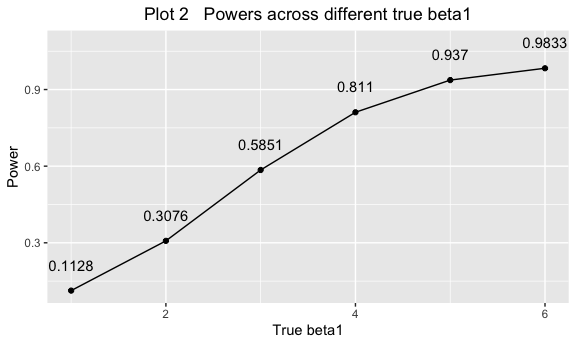

Untitled
================
Ruoyuan Qian
11/2/2019

# Problem 1

``` r
set.seed(10)
iris_with_missing = iris %>%
  map_df(~replace(.x, sample(1:150, 20), NA)) %>%
  mutate(Species = as.character(Species))
```

``` r

fill_na = function(x) {
  
  if (is.numeric(x)) {
    replace = round((mean(x, na.rm = TRUE)),2)
    x[is.na(x)] <- replace
  } else if (is.character(x)) {
    replace = "virginica"
    x[is.na(x)] <- replace
  }
  x
}

iris_with_missing_fill = map(iris_with_missing,fill_na)  
 
  filled_data = as.data.frame(iris_with_missing_fill)
  
```

# Problem 2

``` r
name = list.files(path="./data")

 read_data = function(x){
   file_name = str_c("./data/",x)
   read_csv(file_name) %>% 
     mutate(id = str_sub(x,5,6),
            id = as.numeric(id),
            arm = str_sub(x,1,3))
                        }
```

``` r
result_data %>% 
  mutate( id = factor(id)) %>% 
  group_by(arm,id) %>% 
 ggplot(aes(y = observation, 
            x = week, color = id))+
  geom_line()+
  facet_grid(. ~ arm) +
  viridis::scale_color_viridis(
               discrete = TRUE )+
  theme(legend.position = "bottom")+
  labs(x = "Week",
       y = "Observation",
       title = "Plot 1   Spaghetti plot showing observations on each subject over time"
       )+
   theme(plot.title = element_text(hjust = 0.5))
```


As for the control group, the obervations of subjects generally
unchanged overtime regardless of some fluctuations. However, as for the
experiment group, there is an increasing trend among observations over
time.

# Porblem 3

``` r
set.seed(1)

sim_regression = function(n = 30, beta0 = 2, beta1, mean = 1, sd = sqrt(50)) {
  
  sim_data = tibble(
    x = rnorm(n, 0, 1),
    y = beta0 + beta1 * x + rnorm(n, 0, sd)
  )
  
  ls_fit = lm(y ~ x, data = sim_data)
  
  tibble(
    beta1_hat = coef(ls_fit)[2],
    p_value = tidy(ls_fit)[[2,5]]
  )
}
```

## beta1 = 0

``` r
sim_results = 
  tibble(beta1 = c(0)) %>% 
  mutate(
    output_lists = map(.x = beta1, ~rerun(10000, sim_regression( beta1 = .x))),
    estimate_dfs = map(output_lists, bind_rows)) %>% 
  select(-output_lists) %>% 
  unnest(estimate_dfs)
```

## beta1 = c(1:6)

``` r
sim_results = 
  tibble(beta1 = c(1:6)) %>% 
  mutate(
    output_lists = map(.x = beta1, ~rerun(10000, sim_regression( beta1 = .x))),
    estimate_dfs = map(output_lists, bind_rows)) %>% 
  select(-output_lists) %>% 
  unnest(estimate_dfs)

sim_results %>% 
  group_by(beta1) %>% 
  mutate( n = n()) %>% 
 filter(p_value < 0.05) %>% 
  mutate( n_reject_null = n(),
          proportion = n_reject_null/n) %>% 
  select(beta1,proportion) %>% 
  distinct()
## # A tibble: 6 x 2
## # Groups:   beta1 [6]
##   beta1 proportion
##   <int>      <dbl>
## 1     1      0.110
## 2     2      0.315
## 3     3      0.582
## 4     4      0.816
## 5     5      0.935
## 6     6      0.983
```

``` r
sim_results %>% 
  group_by(beta1) %>% 
  mutate( n = n()) %>% 
 filter(p_value < 0.05) %>% 
  mutate( n_reject_null = n(),
          power = n_reject_null/n) %>% 
  select(beta1,power) %>% 
  distinct() %>% 
 ggplot(aes(x = beta1, y = power))+
  geom_line()  +
  labs(x = "True beta1",
       y = "Power",
       title = "Plot 2   Powers across different true beta1"
       )
```



``` r
plot_mean_all = 
sim_results %>% 
  group_by(beta1) %>% 
  mutate(mean_all = mean(beta1_hat)) %>% 
  filter(p_value < 0.05) %>% 
  mutate( mean_p = mean(beta1_hat)) %>%
  select(beta1,mean_all,mean_p) %>% 
  distinct() %>% 
  ggplot(aes(x = beta1, y = mean_all)) +
  geom_line(aes(color = "mean for all values"))+
  theme(legend.position = "bottom")+
  labs(x = "True beta1",
       y = "Mean of beta1",
       title = "Plot 3  Average estimate of beta1_hat"
       )+
  theme(plot.title = element_text(hjust = 0.5))

plot_mean_all
```


``` r
plot_mean_all+
  geom_line(aes(x = beta1,  y = mean_p, color= "mean for values rejected the null" ))+
   theme(plot.title = element_text(hjust = 0.5))
```


scale\_fill\_discrete(name=“Averagewhen the null was rejected”,
breaks=c(“ctrl”, “trt1”), labels=c(“Control”, “Treatment 1”))
